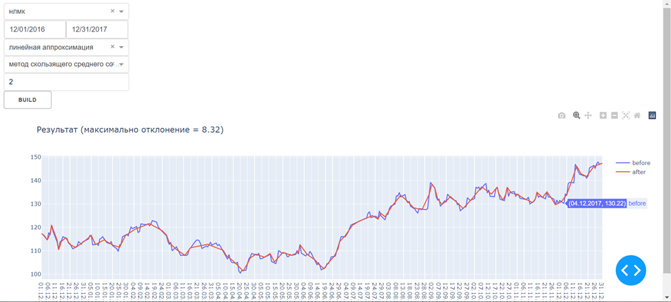
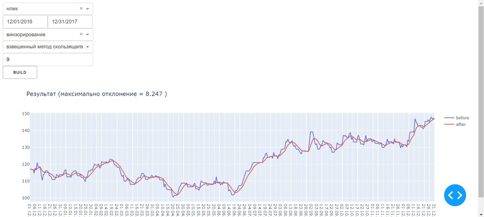

## Задание.
Используя данные котировок акций из Лабораторной работы №3, реализовать графический интерфейс, который должен содержать:
* Выбор тикера акции
* Временной период
* Выбор метода восстановления пропущенных данных (винзорирование, линейная аппроксимация, корреляционное восстановление)
* Выбор метода сглаживания (взвешенный метод скользящего среднего, метод скользящего среднего со скользящим окном наблюдения)
* Выбор максимально допустимого отклонения сглаженного процесса от реального
* Кнопку «Build»

В результате нажатия на кнопку «Build» должны появляться графики исходного процесса после восстановления данных, график сглаженного процесса и информация о максимальном отклонении.

Для реализации интерфейса допускается использование любого модуля на выбор студента.

Для реализации алгоритмов сглаживания использование готовых библиотек не допускается.

## Результат

На данном графике представлены данные, восстановленные методом линейной аппроксимации и сглаженные методом скользящего среднего со скользящим окном наблюдения в 2 рубля (около 1.5%).

На данном графике представлены данные, восстановленные методом винзонирования и сглаженные методом взвешенного скользящего среднего с окном в 9 дней. Окно было выбрано так, чтобы максимальное отклонение было таким же, как в 1 случае.

## Вывод

Функция сглаженных данных в первом случае получается более ломанной и подчеркивает многие экстремумы. Во втором же случае сглаживание получается более ровным и легко регулируемым. Восстановление данных во втором случае получается более нечетким, функция отклонена от сглаженной больше, чем при первом восстановлении.

В результате данной работы был создан интерфейс для отслеживания данных с возможностью их восстановление и последующего сглаживания с учетом пожеланий пользователя. Были повторены методы восстановления, изучены новые методы сглаживания, была проведена работа с библиотеками dash, plotly.  
