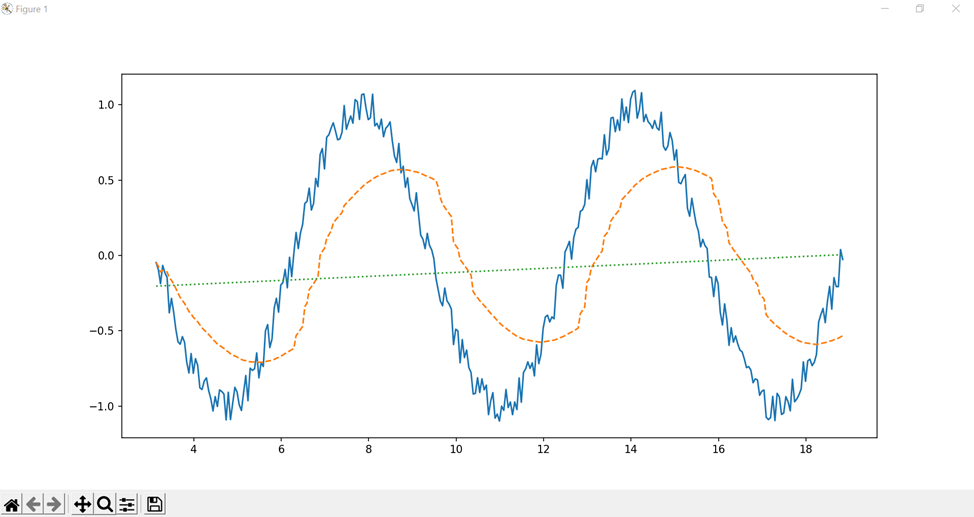
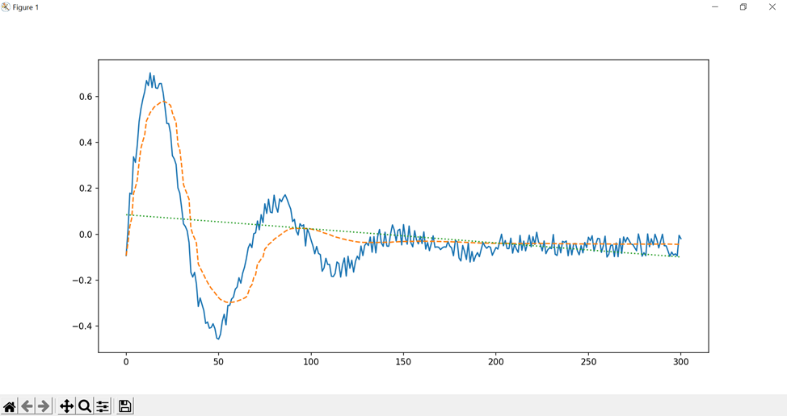
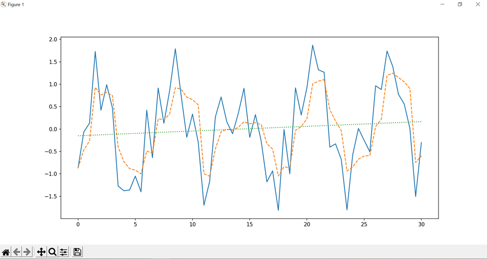

### Задание.
Создайте документ Excel. Заполните строку значениями функции f(x)=sin(x)+0.1*sin(x^5 ). Пользователь задает начальное значение, конечное и шаг.
1) Реализуйте сглаживание для данных, хранящихся в таблице Excel, используя динамическое скользящее окно. Критерием для размера динамического окна может быть отклонение сглаженной функции от исходной или максимальное СКО для сглаженной функции.
2) Для сглаженной функции реализуйте метод наименьших квадратов.
3) Реализуйте алгоритм прогнозирования (на один шаг вперед), используя линейную аппроксимацию на сглаженных данных и исходных данных. Используйте два предыдущих значения, по отношению к прогнозируемому. Оцените погрешность при разных начальных условиях.
4) Повторите вышеописанные пункты еще для 2-х функций, выбранных студентом самостоятельно. 

