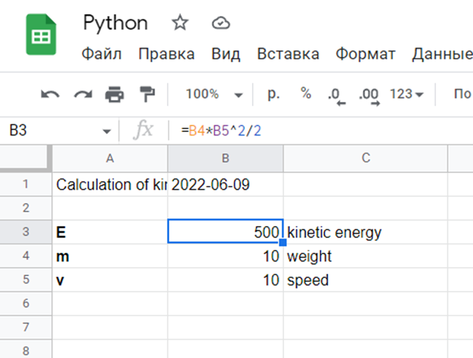

### Задача №1
Задание.
Имеется документ в google-таблицах, содержащий информацию о курсе любой валюты, выбранной студентом. Оценить, завышен или занижен её курс, используя авторегрессионную модель [1]. Допускается использовать любые библиотеки.

В данной программе реализованы несколько функций:

* google_table: с помощью библиотеки gspread были взяты данные из google таблицы (даты и курс), здесь же вызывается следующая функция;
* get_regression_equation: здесь получаются коэффициент авторегрессии. Простейшим примером является авторегрессионный процесс первого порядка AR(1)-процесс. Для данного процесса коэффициент авторегрессии совпадает с коэффициентом автокорреляции первого порядка;
* search_b: считается коэффициентом автокорреляции первого порядка.

Результат работы программы для марта

Синим цветом показаны исходные данные, рыжим – спрогнозированные. В данном случае, когда курс достиг пика, он был завышен.

Результат работы программы для мая

В данном случае, в начале месяца курс был завышен, перед концом - занижен.

Вывод по задаче. В результате данной работы была создана программа, позволяющая по данным из google таблицы о курсе валюты наглядно увидеть завышен ли он или занижен. Также была проведена работа с библиотеками matplotlib [2], gspread [3] и другими.

### Задача №2
Задание.
Имеется оформленный шаблон в таблицах google, содержащий описание и пустое поле для некоторых переменных (x, y, z, …) и функции (f(x, y, z, …)). Пример: Пользователь задает созданном интерфейсе название PDF-файла и переменные, после чего происходит расчет функций и все данные сохраняются в заранее подготовленной форме в гугл-таблицах. Аналогичная таблица сохраняется в виде PDF-файла, название которого содержит дату создания файла (гггг-мм-дд) и название, заданное в интерфейсе (пример: «2022-02-02 – кинетическая энергия первый расчет», «2022-02-03 – кинетическая энергия второй расчет»)

В данной программе реализовано:

* построение интерфейса с помощью библиотеки dash [4] с полями ввода данных и вывода;
* функция update_output, вызывающая основную и сообщающая пользователю сообщение;
* функция google_table, записывающая переданные ей значения в таблицу и вызывающая функцию создания pdf документа в которую передает все данные из таблицы;
* функция create_pdf, записывающая всю информацию в документ и сохраняющая его.

Интерфейс программы

Вводим значения, нажимаем на кнопку, получаем ответ через какое-то время. Название файла необходимо вводить на английском.

Google таблица с введенными значениями

В данном случае происходит расчет кинетической энергии через массу и скорость.

Сохраненный pdf документ

В документе находится вся информация из таблицы.

Вывод по задаче. В результате данной работы был создан интерфейс позволяющий пользователю удобно ввести данные и получить pdf файл с результатами расчетов, приведенных в google таблице. Также была проведена работа с библиотеками gspread[3], dash[4], fpdf[5].

### Задача №3

Задание.
Создать интерфейс, который предлагает выбрать и открыть ранее созданные PDF файлы (директория задается заранее в программе). Пользователь видит название файла без даты (пример: «кинетическая энергия первый расчет», «кинетическая энергия второй расчет»).

В данной программе реализовано:

* построение интерфейса с помощью библиотеки dash [4] с полями ввода данных и вывода, кнопкой;
* функция получения имен файлов, удаляющая даты;
* функция открытия в браузере выбранного файла или вывода сообщения об ошибке.

Интерфейс программы

Вывод по задаче. В результате данной работы был создан интерфейс для выбора и открытия созданных файлов с помощью библиотек dash [4] и других. В данной задаче важно, чтобы имена фалов были определенного стандарта.

### СПИСОК ЛИТЕРАТУРЫ
1. Wikipedia. Авторегрессионная модель [Электронный ресурс] – https://ru.wikipedia.org/wiki/Авторегрессионная_модель (09.06.2022);
2. Matplotlib: Visualization with Python. [Электронный ресурс] – https://matplotlib.org/ (09.06.2022);
3. Gspread. [Электронный ресурс] – https://docs.gspread.org/en/latest/ (21.02.2022);
4. Plotly. Dash Python User Guide. [Электронный ресурс] – https://dash.plotly.com/ (09.06.2022);
5. PyFPDF. FPDF for Python. [Электронный ресурс] – https://pyfpdf.readthedocs.io/en/latest/ (09.06.2022). 
